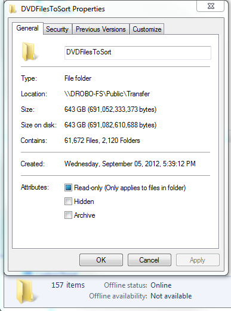

# Copy Files on Insert

Long ago I used to burn files to DVDs when I ran out of hard drive space. I decided to copy them over to my Drobo NAS which has plenty of space, but there were a ton of discs. It was going to take forever, and I would tend to copy one then get engrossed in whatever I'm doing and forget to keep copying.

So I wrote this utility. Now I could just put a disc in and this would copy the contents to a preset folder with the unique disc ID and the disc name appended. When a disc finishes, the utility plays a sound and ejects the disc. Any time I heard the sound or saw the drive open I could just put a new one in. It still took a while, but I copied 157 DVDs containing 643 GB using this utility.

A few notes:

* Visually only a progress bar is shown indicating percent of files copied (not size copied, which would have actually made more sense).
* For a bit of fun, I also implemented the progress bar in the taskbar for Windows 7+.
* Log.txt is written to the program directory with a few extra details and any errors.
* If a disc is scratched or otherwise unreadable Windows may act very strange with copy operations. It may start to copy then just never finish with no errors. This isn't specific to the utility and there isn't much I can do about it. Try the program "Unstoppable Copier" if you need to work with messed up discs.

